---
## Front matter
title: "Лабораторная работа №8"
subtitle: "Программирование цикла. Обработка аргументов командной строки."
author: "Соколова Александра Олеговна"

## Generic otions
lang: ru-RU
toc-title: "Содержание"

## Bibliography
bibliography: bib/cite.bib
csl: pandoc/csl/gost-r-7-0-5-2008-numeric.csl

## Pdf output format
toc: true # Table of contents
toc-depth: 2
lof: true # List of figures
fontsize: 12pt
linestretch: 1.5
papersize: a4
documentclass: scrreprt
## I18n polyglossia
polyglossia-lang:
  name: russian
  options:
	- spelling=modern
	- babelshorthands=true
polyglossia-otherlangs:
  name: english
## I18n babel
babel-lang: russian
babel-otherlangs: english
## Fonts
mainfont: PT Serif
romanfont: PT Serif
sansfont: PT Sans
monofont: PT Mono
mainfontoptions: Ligatures=TeX
romanfontoptions: Ligatures=TeX
sansfontoptions: Ligatures=TeX,Scale=MatchLowercase
monofontoptions: Scale=MatchLowercase,Scale=0.9
## Biblatex
biblatex: true
biblio-style: "gost-numeric"
biblatexoptions:
  - parentracker=true
  - backend=biber
  - hyperref=auto
  - language=auto
  - autolang=other*
  - citestyle=gost-numeric
## Pandoc-crossref LaTeX customization
figureTitle: "Рис."
tableTitle: "Таблица"
listingTitle: "Листинг"
lofTitle: "Список иллюстраций"
lolTitle: "Листинги"
## Misc options
indent: true
header-includes:
  - \usepackage{indentfirst}
  - \usepackage{float} # keep figures where there are in the text
  - \floatplacement{figure}{H} # keep figures where there are in the text
---

# Цель работы
Приобретение навыков написания программ с использованием циклов и обработкой
аргументов командной строки.

# Задание

1. Реализация циклов в NASM
2. Обработка аргументов командной строки
3. Задание для самостоятельной работы

# Теоретическое введение

Стек — это структура данных, организованная по принципу LIFO («Last In — First Out»
или «последним пришёл — первым ушёл»). Стек является частью архитектуры процессора и
реализован на аппаратном уровне. Для работы со стеком в процессоре есть специальные
регистры (ss, bp, sp) и команды.
Основной функцией стека является функция сохранения адресов возврата и передачи
аргументов при вызове процедур. Кроме того, в нём выделяется память для локальных
переменных и могут временно храниться значения регистров.

Стек имеет вершину, адрес последнего добавленного элемента, который хранится в регистре esp (указатель стека). Противоположный конец стека называется дном. Значение,
помещённое в стек последним, извлекается первым. При помещении значения в стек указа-
тель стека уменьшается, а при извлечении — увеличивается.
Для стека существует две основные операции:
• добавление элемента в вершину стека (push);
• извлечение элемента из вершины стека (pop).

# Выполнение лабораторной работы
## Реализация циклов в NASM
Создаю директорию,в которой буду выполнять лабораторную работу (рис.1).

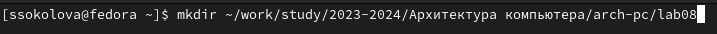{#fig:001 width=70%}

Перехожу в созданный каталог (рис.2).

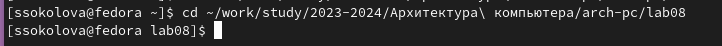{#fig:002 width=70%}

Создаю файл lab8.asm (рис.3). В нём буду делать первое задание.

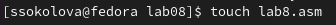{#fig:003 width=70%}

Также копирую в каталог файл in_out.asm (рис.4). Он понадобится для написания будущих программ.

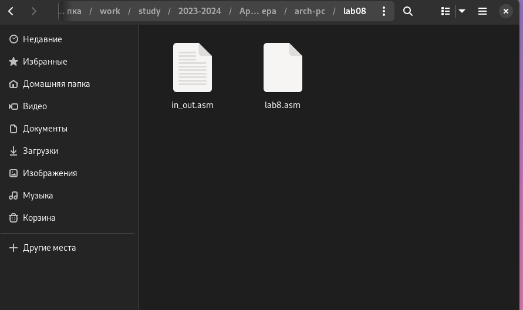{#fig:004 width=70%}

Записываю текст кода из листинга 8.1 (рис.5). Эта программа запрашивает число N, и выдает все числа перед N вместе с ним до 0.

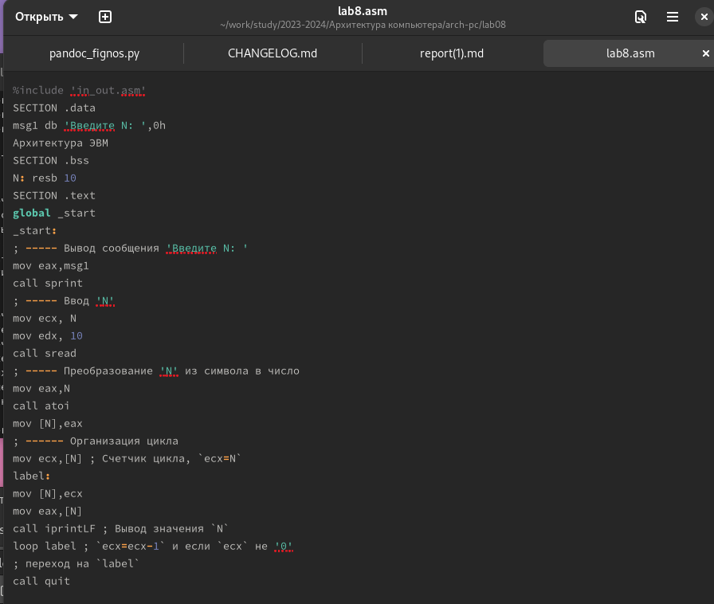{#fig:005 width=70%}

Создаю исполняемый код (рис.6).После его запуска убеждаюсь,что программа работает успешно.

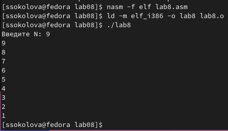{#fig:006 width=70%}

Теперь я редактирую код,добавив изменение значение регистра ecx в цикле (рис.7).

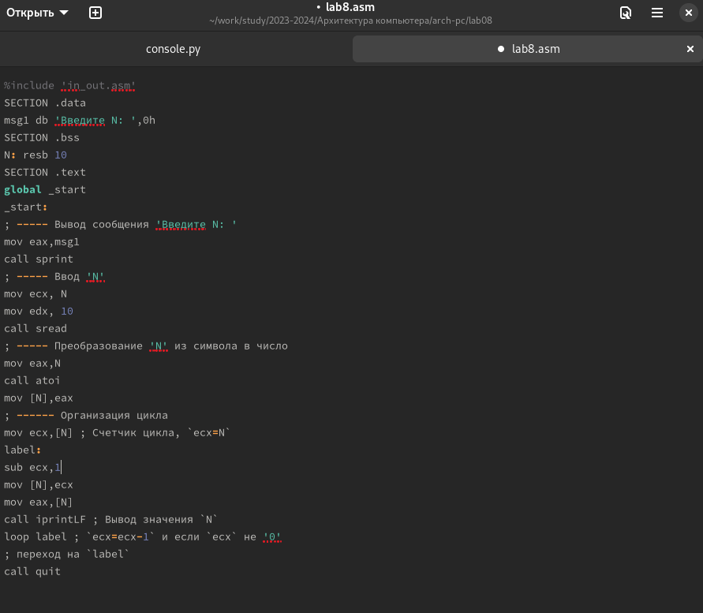{#fig:007 width=70%}

Запускаю программу. Теперь код зацикливается и начинает бесконечно передавать последовательные значения, но перескакивает через 1 (рис.8).

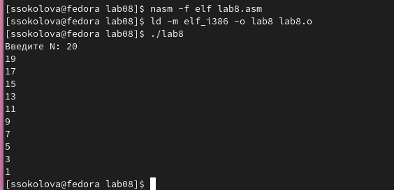{#fig:008 width=70%}

Еще раз редактирую код программы,добавив команды push и pop (добавления в стек и извлечения из стека) для сохранения значения счетчика цикла loop (рис.10).

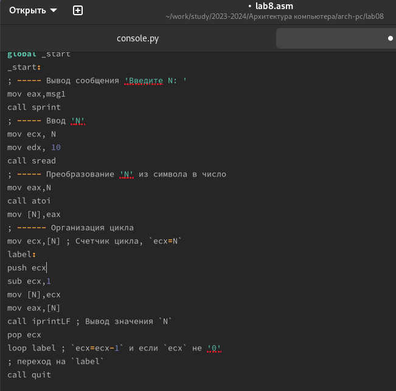{#fig:010 width=70%}

Создаю и запускаю исполняемый файл (рис.11). Теперь программа показывает все предыдущие числа до 0,не включая заданное N

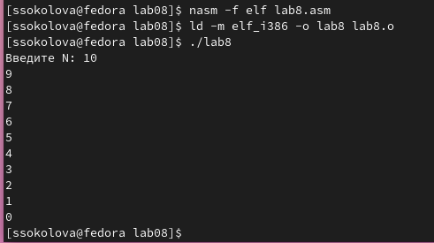{#fig:011 width=70%}

## Обработка аргументов командной строки

Создаю новый файл lab8-2.asm, используя команду touch (рис.12). 

{#fig:012 width=70%}

Открываю файл в текстовом редакторе и записываю код из листинга 8.2 (рис.13). Данная программа позволяет выводить на экран аргументы командной строки.

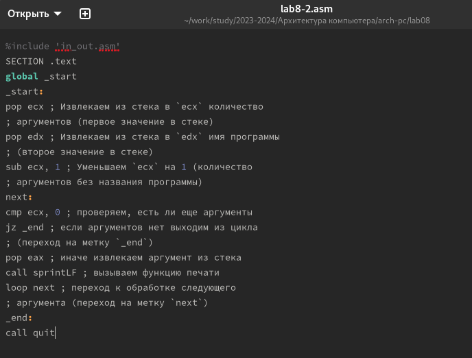{#fig:013 width=70%}

Запускаю исполняемый файл вместе с аргументами (аргумент1, аргумент2, 'аргумент3') (рис.14).

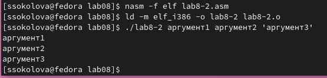{#fig:014 width=70%}

Создаю новый файл lab8-3.asm, используя команду touch (рис.15). 

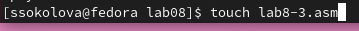{#fig:015 width=70%}

Открываю файл в текстовом редакторе и записываю код из листинга 8.3 (рис.16). Данная программа позволяет выводить на экран сумму аргументов командной строки.
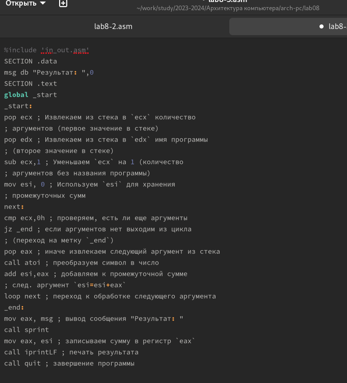{#fig:016 width=70%}

Запускаю исполняемый файл вместе с аргументами (12,13,7,10,5) (рис.17). Программа действительно выдаёт сумму всех аргументов.

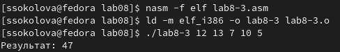{#fig:017 width=70%}

Теперь редактирую код программы так,чтобы она выводила произведение всех аргументов (рис.18).

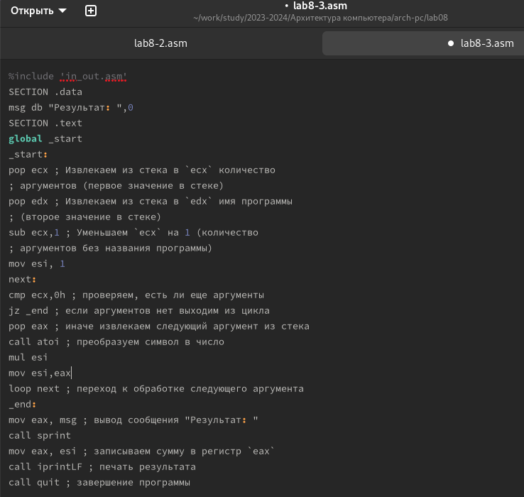{#fig:018 width=70%}

```NASM
%include 'in_out.asm'
SECTION .data
msg db "Результат: ",0
SECTION .text
global _start
_start:
pop ecx ; Извлекаем из стека в `ecx` количество
; аргументов (первое значение в стеке)
pop edx ; Извлекаем из стека в `edx` имя программы
; (второе значение в стеке)
sub ecx,1 ; Уменьшаем `ecx` на 1 (количество
; аргументов без названия программы)
mov esi, 1 
next:
cmp ecx,0h ; проверяем, есть ли еще аргументы
jz _end ; если аргументов нет выходим из цикла
pop eax ; иначе извлекаем следующий аргумент из стека
call atoi ; преобразуем символ в числ
mul esi
mov esi,eax
loop next ; переход к обработке следующего аргумента
_end:
mov eax, msg ; вывод сообщения "Результат: "
call sprint
mov eax, esi ; записываем сумму в регистр `eax`
call iprintLF ; печать результата
call quit ; завершение программы
```

Запускаю исполняемый файл вместе с аргументами (1,3,4,7) (рис.19). Программа  выдаёт произведение всех аргументов.

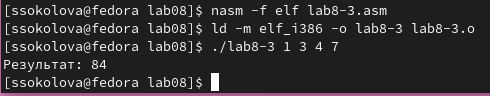{#fig:019 width=70%}

## Задание для самостоятельной работы

Создаю файл lab8-4.asm в котором буду писать код для последней задачи (рис.20).

{#fig:020 width=70%}

Пишу код программы,который позволяет вывести сумму всех преобразованных аргументов. Преобразования я беру из варианта задания №15 6x+13 (рис.21).

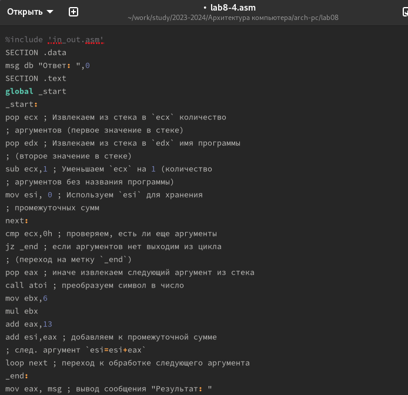{#fig:021 width=70%}

```NASM
%include 'in_out.asm'
SECTION .data
msg db "Ответ: ",0
SECTION .text
global _start
_start:
pop ecx ; Извлекаем из стека в `ecx` количество
; аргументов (первое значение в стеке)
pop edx ; Извлекаем из стека в `edx` имя программы
; (второе значение в стеке)
sub ecx,1 ; Уменьшаем `ecx` на 1 (количество
; аргументов без названия программы)
mov esi, 0 ; Используем `esi` для хранения
; промежуточных сумм
next:
cmp ecx,0h ; проверяем, есть ли еще аргументы
jz _end ; если аргументов нет выходим из цикла
; (переход на метку `_end`)
pop eax ; иначе извлекаем следующий аргумент из стека
call atoi ; преобразуем символ в число
mov ebx,6
mul ebx
add eax,13
add esi,eax ; добавляем к промежуточной сумме
; след. аргумент `esi=esi+eax`
loop next ; переход к обработке следующего аргумента
_end:
mov eax, msg ; вывод сообщения "Результат: "
call sprint
mov eax, esi ; записываем сумму в регистр `eax`
call iprintLF ; печать результата
call quit ; завершение программы
```

Запускаю исполняемый файл вместе с аргументами (1,2,3,4) (рис.22). Программа  выдаёт верную сумму всех преобразованных аргументов.

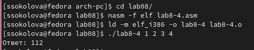{#fig:022 width=70%}

Повторно запускаю программу,чтобы убедиться, что всё работает верно (рис.23). Программа выдает верный ответ.

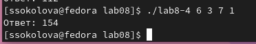{#fig:023 width=70%}


# Выводы

В данной лабораторной работать я научился работать с циклами, выводом аргументов и функций.

# Список литературы{.unnumbered}

1. Лабораторная работа №8

