---
## Front matter
title: "Отчет по лабораторной работе №6"
subtitle: "Дисциплина: архитектура компьютера"
author: "Соколова Александра Олеговна"

## Generic otions
lang: ru-RU
toc-title: "Содержание"

## Bibliography
bibliography: bib/cite.bib
csl: pandoc/csl/gost-r-7-0-5-2008-numeric.csl

## Pdf output format
toc: true # Table of contents
toc-depth: 2
lof: true # List of figures
fontsize: 12pt
linestretch: 1.5
papersize: a4
documentclass: scrreprt
## I18n polyglossia
polyglossia-lang:
  name: russian
  options:
	- spelling=modern
	- babelshorthands=true
polyglossia-otherlangs:
  name: english
## I18n babel
babel-lang: russian
babel-otherlangs: english
## Fonts
mainfont: PT Serif
romanfont: PT Serif
sansfont: PT Sans
monofont: PT Mono
mainfontoptions: Ligatures=TeX
romanfontoptions: Ligatures=TeX
sansfontoptions: Ligatures=TeX,Scale=MatchLowercase
monofontoptions: Scale=MatchLowercase,Scale=0.9
## Biblatex
biblatex: true
biblio-style: "gost-numeric"
biblatexoptions:
  - parentracker=true
  - backend=biber
  - hyperref=auto
  - language=auto
  - autolang=other*
  - citestyle=gost-numeric
## Pandoc-crossref LaTeX customization
figureTitle: "Рис."
listingTitle: "Листинг"
lofTitle: "Список иллюстраций"
lolTitle: "Листинги"
## Misc options
indent: true
header-includes:
  - \usepackage{indentfirst}
  - \usepackage{float} # keep figures where there are in the text
  - \floatplacement{figure}{H} # keep figures where there are in the text
---

# Цель работы

Цель данной лабораторной работы - освоение арифметческих инструкций языка ассемблера NASM.

# Задание

1. Символьные и численные данные в NASM
2. Выполнение арифметических операций в NASM
3. Выполнение заданий для самостоятельной работы

# Теоретическое введение

Большинство инструкций на языке ассемблера требуют обработки операндов. Адрес операнда предоставляет место, где хранятся данные, подлежащие обработке. Это могут быть данные хранящиеся в регистре или в ячейке памяти. 
- Регистровая адресация – операнды хранятся в регистрах и в команде используются имена этих регистров, например: mov ax,bx.
- Непосредственная адресация – значение операнда задается непосредственно в команде, Например: mov ax,2.
- Адресация памяти – операнд задает адрес в памяти. В команде указывается символическое обозначение ячейки памяти, над содержимым которой требуется выполнить операцию.

Ввод информации с клавиатуры и вывод её на экран осуществляется в символьном виде. Кодирование этой информации производится согласно кодовой таблице символов ASCII. ASCII – сокращение от American Standard Code for Information Interchange (Американский стандартный код для обмена информацией). Согласно стандарту ASCII каждый символ кодируется одним байтом.
Среди инструкций NASM нет такой, которая выводит числа (не в символьном виде). Поэтому, например, чтобы вывести число, надо предварительно преобразовать его цифры в ASCII-коды этих цифр и выводить на экран эти коды, а не само число. Если же выводить число на экран непосредственно, то экран воспримет его не как число, а как последовательность ASCII-символов – каждый байт числа будет воспринят как один ASCII-символ – и выведет на экран эти символы.
Аналогичная ситуация происходит и при вводе данных с клавиатуры. Введенные данные будут представлять собой символы, что сделает невозможным получение корректного результата при выполнении над ними арифметических операций.
Для решения этой проблемы необходимо проводить преобразование ASCII символов в числа и обратно

# Выполнение лабораторной работы

## Символьные и численные данные в NASM

С помощью утилиты mkdir создаю директорию, в которой буду создавать файлы с программами для лабораторной работы №6 (рис.1). Перехожу в созданный каталог с помощью утилиты cd.

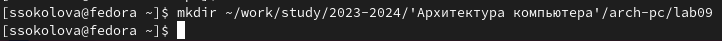{ #fig:001 width=70% }

С помощью утилиты touch создаю файл lab6-1.asm (рис.2).

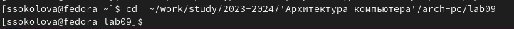{ #fig:002 width=70% }

Копирую в текущий каталог файл in_out.asm с помощью утилиты cp, т.к. он будет использоваться в других программах (рис.3).

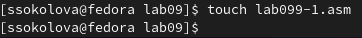{ #fig:003 width=70% }

Открываю созданный файл lab6-1.asm, вставляю в него программу вывода значения регистра eax (рис.4).

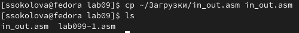{ #fig:004 width=70% }

Создаю исполняемый файл программы и запускаю его (рис.5). Вывод программы: символ j, потому что программа вывела символ, соответствующий по системе ASCII сумме двоичных кодов символов 4 и 6.

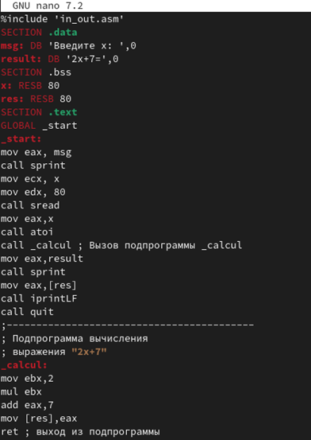{ #fig:005 width=70% }

Изменяю в тексте программы символы "6" и "4" на цифры 6 и 4 (рис.6). 

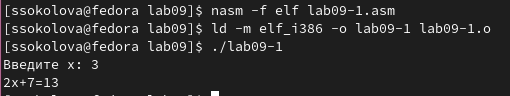{ #fig:006 width=70% }

Создаю новый исполняемый файл программы и запускаю его (рис.7). Теперь вывелся символ с кодом 10, это символ перевода строки, этот символ не отображается при выводе на экран.

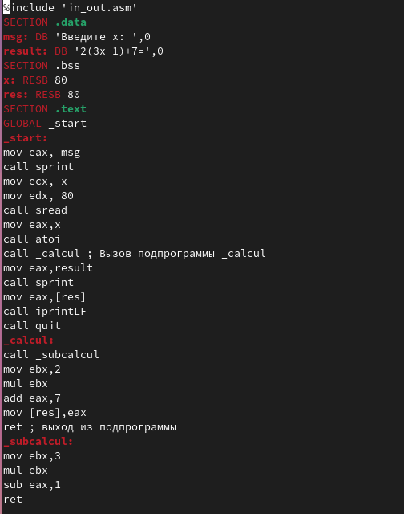{ #fig:007 width=70% }

Создаю новый файл lab6-2.asm с помощью утилиты touch (рис.8).

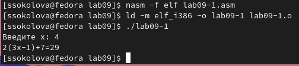{ #fig:008 width=70% }

Ввожу в файл текст другойпрограммы для вывода значения регистра eax (рис.9).

{ #fig:009 width=70% }

Создаю и запускаю исполняемый файл lab6-2 (рис.10). Теперь вывод число 106, потому что программа позволяет вывести именно число, а не символ, хотя все еще происходит именно сложение кодов символов "6" и "4".

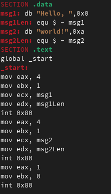{ #fig:010 width=70% }

Заменяю в тексте программы в файле lab6-2.asm символы "6" и "4" на числа 6 и 4 (рис.11).

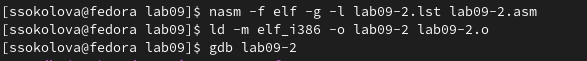{ #fig:011 width=70% }

Создаю и запускаю новый исполняемый файл (рис.12).. Теперь программа складывает не соответствующие символам коды в системе ASCII, а сами числа, поэтому вывод 10.

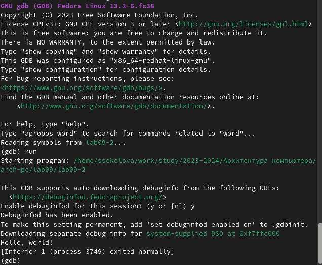{ #fig:012 width=70% }

Заменяю в тексте программы функцию iprintLF на iprint (рис.13).

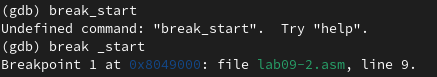{ #fig:013 width=70% }

Создаю и запускаю новый исполняемый файл (рис.14). Вывод не изменился, потому что символ переноса строки не отображался, когда программа исполнялась с функцией iprintLF, а iprint не добавляет к выводу символ переноса строки, в отличие от iprintLF.

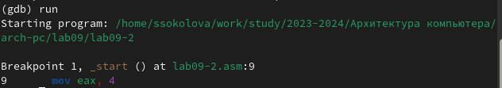{ #fig:014 width=70% }

## Выполнение арифметических операций в NASM

Создаю файл lab6-3.asm с помощью утилиты touch (рис.15).

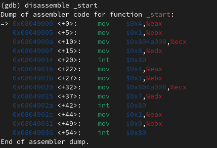{ #fig:015 width=70% }

Ввожу в созданный файл текст программы для вычисления значения выражения f(x) = (5 * 2 + 3)/3 (рис.16).

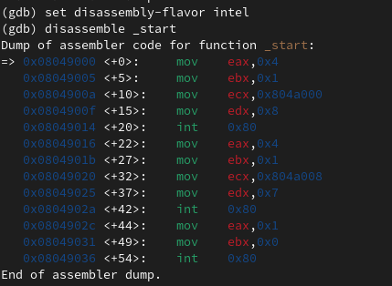{ #fig:016 width=70% }

Создаю исполняемый файл и запускаю его (рис.17).

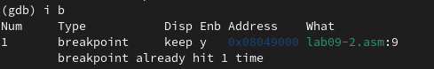{ #fig:017 width=70% }

Изменяю программу так, чтобы она вычисляла значение выражения f(x) = (4 * 6 + 2)/5 (рис.18). 

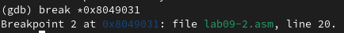{ #fig:018 width=70% }

Создаю и запускаю новый исполняемый файл (рис.19). Я посчитала для проверки правильности работы программы значение выражения самостоятельно, программа отработала верно.

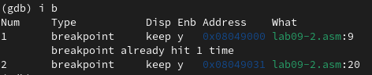{ #fig:019 width=70% }

Создаю файл variant.asm с помощью  утилиты touch (рис.20).

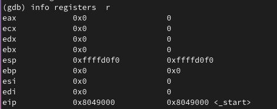{ #fig:020 width=70% }

Ввожу в файл текст программы для вычисления варианта задания по номеру студенческого билета (рис.21).

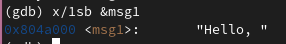{ #fig:021 width=70% }

Создаю и запускаю исполняемый файл (рис.22). Ввожу номер своего студ. билета с клавиатуры, программа вывела, что мой вариант - 15.

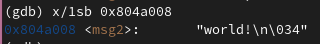{ #fig:022 width=70% }

### Ответы на вопросы по программе

1. За вывод сообщения "Ваш вариант" отвечают строки кода:

```NASM
mov eax,rem
call sprint
```
2. Инструкция mov ecx, x используется, чтобы положить адрес вводимой строки x в регистр ecx
mov edx, 80 - запись в регистр edx длины вводимой строки 
call sread - вызов подпрограммы из внешнего файла, обеспечивающей ввод сообщения с клавиатуры  

3. call atoi используется для вызова подпрограммы из внешнего файла, которая преобразует ascii-код символа в целое число и записывает результат в регистр eax

4. За вычисления варианта отвечают строки:

```NASM
xor edx,edx ; обнуление edx для корректной работы div
mov ebx,20 ; ebx = 20
div ebx ; eax = eax/20, edx - остаток от деления
inc edx ; edx = edx + 1
```

5. При выполнении инструкции div ebx остаток от деления записывается в регистр edx

6. Инструкция inc edx увеличивает значение регистра edx на 1

7. За вывод на экран результатов вычислений отвечают строки:

```NASM
mov eax,edx
call iprintLF
```

## Выполнение заданий для самостоятельной работы

Создаю файл lab6-4.asm с помощью утилиты touch (рис.23).

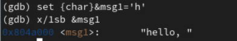{ #fig:023 width=70% }

Открываю созданный файл для редактирования, ввожу в него текст программы для вычисления значения выражения (5+x)^2-3 (рис.24). Это выражение было под вариантом 15.

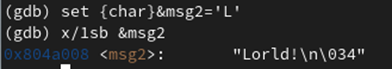{ #fig:024 width=70% }

Создаю и запускаю исполняемый файл (рис.25). 

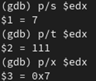{ #fig:025 width=70% }

Провожу еще один запуск исполняемого файла для проверки работы программы с другим значением на входе (рис.26). Программа отработала верно.

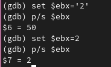{ #fig:026 width=70% }

**Листинг 4.1. Программа для вычисления значения выражения (x+5)^2-3.**

```NASM
%include 'in_out.asm' ; подключение внешнего файла
SECTION .data ; секция инициированных данных
msg: DB 'Введите значение переменной х: ',0
rem: DB 'Результат: ',0
SECTION .bss ; секция не инициированных данных
x: RESB 80 ; Переменная, значение к-рой будем вводить с клавиатуры, выделенный ра
SECTION .text ; Код программы
GLOBAL _start ; Начало программы
_start: ; Точка входа в программу
; ---- Вычисление выражения
mov eax, msg ; запись адреса выводимиого сообщения в eax
call sprint ; вызов подпрограммы печати сообщения
mov ecx, x ; запись адреса переменной в ecx
mov edx, 80 ; запись длины вводимого значения в edx
call sread ; вызов подпрограммы ввода сообщения
mov eax,x ; вызов подпрограммы преобразования
call atoi ; ASCII кода в число, `eax=x`
add eax,5; eax = eax+5 = x + 5
imul eax, eax ; умножаем eax на само себя, то есть возводим в квадрат
sub eax,3; eax = eax-6 = (x+5)*(x+5)-3
mov edi,eax ; запись результата вычисления в 'edi'
; ---- Вывод результата на экран
mov eax,rem ; вызов подпрограммы печати
call sprint ; сообщения 'Результат: '
mov eax,edi ; вызов подпрограммы печати значения
call iprintLF ; из 'edi' в виде символов
call quit ; вызов подпрограммы завершения
```

# Выводы

При выполнении данной лабораторной работы я освоила арифметические инструкции языка ассемблера NASM.

# Список литературы

1. [Лабораторная работа №7](https://esystem.rudn.ru/pluginfile.php/1584637/mod_resource/content/1/%D0%9B%D0%B0%D0%B1%D0%BE%D1%80%D0%B0%D1%82%D0%BE%D1%80%D0%BD%D0%B0%D1%8F%20%D1%80%D0%B0%D0%B1%D0%BE%D1%82%D0%B0%20%E2%84%967.pdf)
2. [Таблица ASCII](https://www.rapidtables.com/code/text/ascii-table.html)

